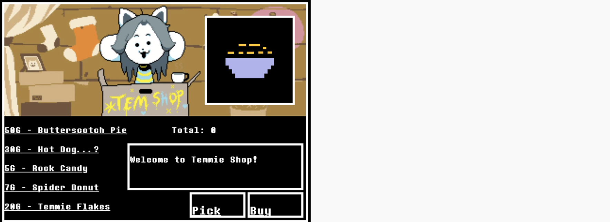

# SD2 Milestone Test 8

Welcome to SD2 Milestone Test 8 main page. You will be tested based on what you've learned in the previous meetings. 
Your subject for today's test is HTML and Javascript.

## Project

### Tem Shop

Welcome to Temmie Village! Tem is trying to find a way to fund her college. So she
become a shopkeeper at Temmie Village. She sells various goods for visitors to buy. However, something is wrong. When visitor selects the items, it does not do anything, when it should have adds it to the total purchase, and visitors are able to purchase the whole things after. Please help Tem to set up her shop.

For your Project, please load the folder tem_shop_template to your prefered code editor (Brackets, Notepad++, etc). Here, you are given three files and an 'assets' folder. The three files are 'index.html', 'style.css', and 'main.js'. Your task is to code in 'main.js' file for the shop to work.

* When any of the goods are clicked, show the description text on the message box and the image of the goods on the image box.
* When user clicks on the 'Pick' button, the change the total by adding the price of the selected goods.
* When user clicks on the 'Buy' button, set the total to 0, and display the thank you message.

| Use               | Dialogue Text                                            |
|-------------------|:--------------------------------------------------------:|
| Butterscotch Pie  | Butterscotch-cinnamon pie, one slice.                    |
| Hot Dog           | The meat is made of something called a water sausage.    |
| Rock Candy        | Here is a recipe to make this at home: 1. Find a rock    |
| Spider Donut      | A donut made with Spider Cider in the batter.            |
| Temmie Flakes     | Its just torn up pieces of construction paper.           |
| 'Buy' Message     | Thank you for shopping at Temmie Shop! Please come again |
| 'Pick' Message    | You picked <<Item Name>>                                 |

#### **Download the file here**
https://tinyurl.com/newMilestoneSD2-6-1

## Debug

Comming Soon...

## GOOD LUCK
